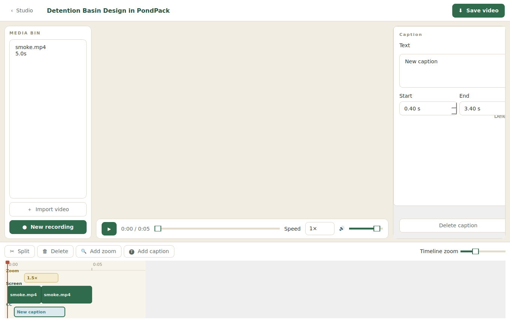
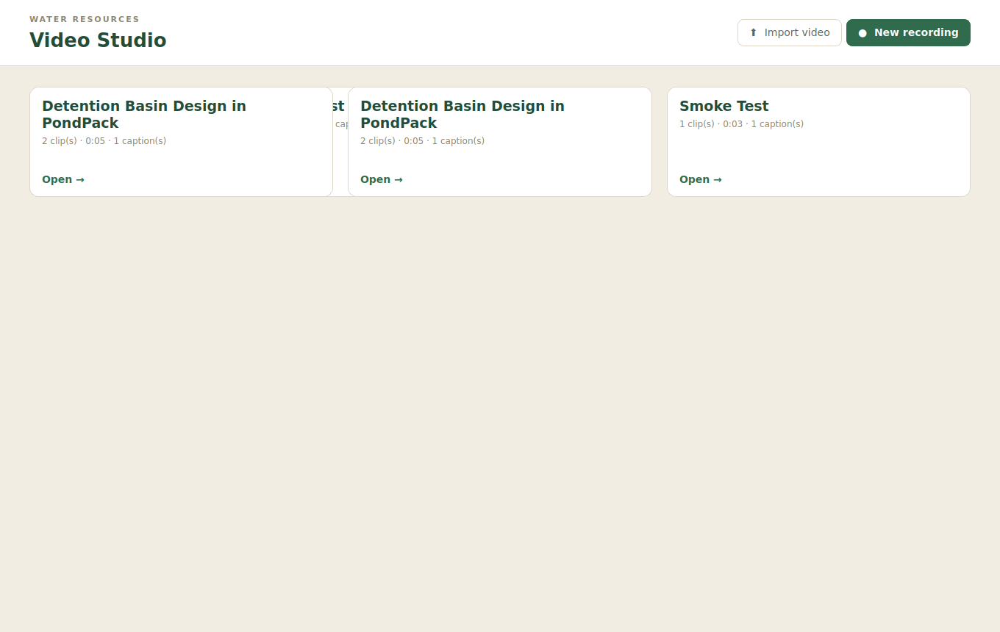

# Video Studio

A real desktop **screen recorder and video editor** for the Water Resources
training program. Record your screen, trim and split the footage, add zoom
highlights and captions, then export a finished MP4 — all in a native app.

Built with **Python + PySide6 (Qt)**, with a bundled **ffmpeg** doing the video
work, so there is nothing extra to install.



> This replaces the earlier web/Electron design prototype (now in
> [`legacy-web/`](legacy-web/)), where most of the editing controls were
> decorative. Here they actually work.

## What actually works

- **Screen recording** — capture your screen (plus microphone) straight to a
  clip via ffmpeg, with a 3-2-1 countdown and a live recording HUD.
- **Import** any `.mp4 / .mov / .webm / .mkv / .avi` file.
- **Playback** the timeline with real transport: play/pause, scrub, 1× / 1.5× /
  2× speed, and volume.
- **Edit the timeline** — clips laid end to end that you can:
  - **Split** at the playhead,
  - **Trim** by dragging a clip's left/right edge,
  - **Delete**,
  - reorder by editing (ripple is automatic).
- **Zoom highlights** — add a push-in over any range, with adjustable level and
  focus point; rendered into the exported video.
- **Captions** — add text over any range; shown live in the preview and burned
  into the export.
- **Per-clip properties** — playback speed and volume.
- **Export** — renders the whole edit (trim + concat + zoom + captions) to an
  MP4 with a progress bar. Projects auto-save and reappear on the home screen.



### Preview vs. export
The preview plays your trimmed clips in sequence and overlays captions live.
**Zoom** is shown as a marker on the timeline and applied when you **Export** —
compositing a live push-in on the preview frame isn't worth the cost, so the
final render is the source of truth for zoom.

## Get the Windows app (no tools needed)

Every push builds a Windows installer and a portable zip in the cloud:

1. Open the repo on GitHub → **Actions** → the latest **Build Windows app** run.
2. Download the **`Video-Studio-Windows`** artifact. It contains:
   - **`VideoStudioSetup.exe`** — installer (Start-menu + optional desktop shortcut).
   - **`VideoStudio-Windows-portable.zip`** — unzip and run `Video Studio.exe`, no install.

The app isn't code-signed, so Windows may show **"Windows protected your PC"** the
first time — click **More info → Run anyway**.

## Run from source

```bash
python -m venv .venv
# Windows:  .venv\Scripts\activate     macOS/Linux:  source .venv/bin/activate
pip install -r requirements.txt
python main.py
```

Python 3.10+ recommended. ffmpeg is provided by `imageio-ffmpeg`, so you don't
need to install it separately. Screen recording uses the OS capture backend
(Windows `gdigrab`, macOS `avfoundation`, Linux `x11grab`).

## Build the installer yourself

```bash
pip install pyinstaller
pyinstaller --noconfirm VideoStudio.spec      # -> dist/Video Studio/
# Windows, with Inno Setup installed:
iscc installer.iss                            # -> installer_out/VideoStudioSetup.exe
```

## Project layout

| Path | Role |
| --- | --- |
| `main.py` | Launcher (`python main.py`). |
| `videostudio/model.py` | Pure edit-decision model: clips, zooms, captions; split/trim/delete; JSON save/load. |
| `videostudio/media.py` | Locate ffmpeg (bundled) and probe media. |
| `videostudio/captions.py` | Render caption PNGs (Pillow) for overlay. |
| `videostudio/export.py` | Build the ffmpeg filter graph and render the final video. |
| `videostudio/recorder.py` | Screen + mic recording via ffmpeg. |
| `videostudio/storage.py` | Where projects/recordings live (per-user app data). |
| `videostudio/theme.py` | Palette + Qt stylesheet (comfortable sizing). |
| `videostudio/ui/` | Qt UI: main window, library, editor, preview, timeline, properties, dialogs. |
| `VideoStudio.spec`, `installer.iss` | PyInstaller + Inno Setup packaging. |
| `packaging/`, `videostudio/assets/` | App icons and bundled fonts. |
| `legacy-web/` | The superseded web/Electron prototype. |

## Notes & limits (v1)

- Editing is non-destructive; your source files are never modified.
- A single video track with captions and zoom tracks. Picture-in-picture webcam
  and multi-video-track compositing aren't in this version.
- Caption text is burned in with a bundled font (the static ffmpeg build has no
  `drawtext`), rendered via Pillow for identical output on every machine.
