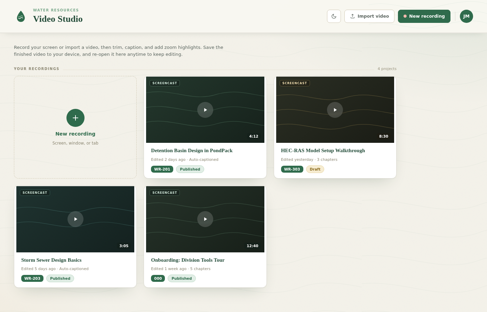

# Video Studio

A screen-recording and lightweight video editor for the Water Resources training
program. Record your screen (or import a video), then trim, caption, and add zoom
highlights — and save the finished video back to your device to re-open and keep
editing later.

Implemented from the **Video Studio** Claude Design project
(`Video Studio.dc.html`).



## What it does

- **Studio home** — a gallery of your recordings plus a one-click *New recording*
  card.
- **Recording flow** — a source picker (full screen / app window / browser tab)
  with webcam, microphone, and system-audio toggles, a 3-second countdown, and a
  live recording HUD. Uses the browser's real `getDisplayMedia` +
  `MediaRecorder` APIs; if screen capture is blocked it falls back to a sample
  project so the editor is always explorable.
- **Editor** — a three-column editing workspace:
  - *Left rail*: media bin, record, text/callouts, and audio panels.
  - *Center*: a 16:9 preview stage with transport controls (play/pause, scrub,
    1× / 1.5× / 2× speed) driving a real `<video>` element for imported or
    recorded clips.
  - *Right rail*: an auto-generated, clickable transcript and a per-clip
    properties panel (zoom, volume, playback speed, smooth-cursor, drop-shadow).
  - A multi-lane **timeline** (zoom, screen, webcam, captions, audio) with
    split / trim / delete / add-zoom tools and a synced playhead.
- **Import & save** — import any local `video/*` file, and *Save video* downloads
  the current clip to your device.
- **Light / dark theme** — toggle in the header; the choice is remembered in
  `localStorage`.

## Running it

Video Studio is packaged as a **desktop app** (Electron). The same files also
run in a plain browser if you prefer — see *Run in a browser* below.

### Desktop app (Electron)

```bash
npm install     # downloads Electron on first run
npm start       # launches the desktop app
```

Build installable distributables for the current platform:

```bash
npm run dist    # → dist/  (.dmg/.zip on macOS, .exe on Windows, .AppImage/.deb on Linux)
npm run pack    # unpacked app directory only (faster, for local testing)
```

The desktop shell (`main.js`) hosts the app in a native window and wires up the
pieces Electron doesn't provide automatically:

- **Screen capture** — services `getDisplayMedia()` via a
  `setDisplayMediaRequestHandler`. On macOS 15+/Windows it defers to the native
  source picker; elsewhere it grants the primary screen so *New recording*
  always captures.
- **Microphone/camera permissions** — granted through a permission handler.
- External links open in the user's real browser.

### Run in a browser

It's also a static site with no build step — serve the folder over HTTP:

```bash
python3 -m http.server 8000    # then visit http://localhost:8000/
```

> **Secure context.** Screen capture and microphone access require a *secure
> context*. The Electron window and `http://localhost` / `https://` origins all
> qualify. Opening `index.html` directly via `file://` in a browser works for
> everything except live capture, which falls back to the sample recording.

## How it's built

The UI is authored in Claude Design's `.dc.html` component format and rendered by
its runtime — no framework build tooling required.

| Path | Role |
| --- | --- |
| `main.js` | Electron main process — creates the native window, loads `index.html`, and wires up `getDisplayMedia`/permission handling. |
| `preload.js` | Minimal, context-isolated preload (no Node exposed to page code). |
| `package.json` | App metadata, `start`/`dist`/`pack` scripts, and the electron-builder config. |
| `build/icon.png` | App icon (used when packaging). |
| `index.html` | The Video Studio component: template (`<x-dc>` markup) + logic (`class Component extends DCLogic`). |
| `support.js` | The Claude Design runtime — parses the `<x-dc>` template DSL (`sc-if`, `sc-for`, `{{ }}` bindings) and renders it with React. |
| `vendor/react*.js` | React 18.3.1 UMD builds, vendored locally so the app runs with no external CDN dependency (the runtime skips its CDN fetch when `window.React` is already present). |
| `_ds/…/` | The **GHA Water Resources** design system: color / typography / spacing / effect tokens, base resets, and the component bundle. This is what gives every screen its palette, fonts, radii, and shadows. |

The renderer is protocol-agnostic — the same `index.html` runs unchanged in the
Electron window (`file://`), over `http://localhost`, or on any static host.

Fonts (Newsreader + Hanken Grotesk) are pulled from Google Fonts via an `@import`
in the design system's `styles.css`, matching how the source project links them;
offline they fall back to system fonts.

### Note on the port

The design authored its hover micro-interactions as inline
`onmouseenter="this.style…"` DOM handlers. React requires real event-listener
functions, so those were moved into named handlers on the component
(`hEnter1`, `hLeaveTransform`, …) and bound through the template — the visible
behavior is unchanged.
